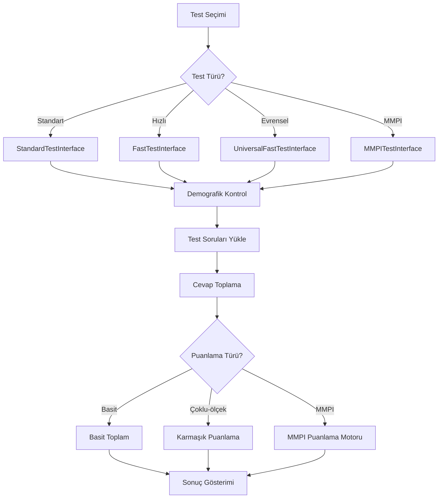

# 🎯 Test Builder Suite - Kapsamlı Kod Analizi ve Yeniden Yapılandırma Planı

## 📊 DETAYLI MEVCUT DURUM ANALİZİ

### 🔍 **1. Test Arayüzü Karmaşıklığı Analizi**

#### **Mevcut Test Arayüzleri:**
- `StandardTestInterface.tsx` (520 satır) - Tek soru gösterimi
- `FastTestInterface.tsx` (949 satır) - Hızlı numpad girişi 
- `UniversalFastTestInterface.tsx` (646 satır) - Evrensel hızlı giriş
- `MMPITestInterface.tsx` (420 satır) - MMPI özel arayüzü
- `BulkMMPIInterface.tsx` - MMPI toplu işlem

**🚨 SORUN:** Toplam ~2500+ satır kod tekrarı!

#### **Her Arayüzün Farklı Özellikleri:**
```typescript
// StandardTestInterface - Sayfa bazlı gezinme
const [oturum, setOturum] = useState<TestOturumu>({
  aktifSoruIndex: 0,
  cevaplar: {},
  yontem: 'standart'
});

// FastTestInterface - Klavye kısayolları + desen analizi
function analyzeTestPattern(test: TestTanimi): TestResponsePattern {
  // MMPI, SCL-90-R, vs için farklı desenler
}

// UniversalFastTestInterface - Dinamik cevap ayarları
const [testInputSettings, setTestInputSettings] = useState<ReturnType<typeof getTestInputSettings>>();

// MMPITestInterface - MMPI özel mantığı
const [mmpiSonuclari, setMmpiSonuclari] = useState<MMPIResults>();
```

### 🗂️ **2. Test Verisi Organizasyon Sorunu**

#### **Mevcut JSON Yapısı:**
```
public/tests/
├── test-list.json (7 test)
├── beck-depresyon-envanteri-bde.json
├── beck-anksiyete-envanteri-bai.json
├── beck-umutsuzluk-olcegi-buo.json
├── beck-intihar-dusuncesi-olcegi-bido.json
├── arizona-cinsel-yasanti-acyo.json
├── young-sema-olcegi-ysq.json
└── scl-90-r-semptom-tarama-listesi.json
```

**🚨 SORUNLAR:**
- Kategori yok (Beck testleri dağınık)
- MMPI hardcode edilmiş lib'de
- Test meta-verileri dağınık
- Yorumlama kuralları gömülü

#### **Test Türü Karmaşıklığı:**
```typescript
// Farklı puanlama türleri
export type PuanlamaTuru = 
  | 'basit'                    // Toplam puan
  | 'cinsiyete-ozel'          // Cinsiyet bazlı
  | 'coklu_alt_olcek'         // Young Şema (18 alt ölçek)
  | 'mmpi-profil'             // MMPI (10 klinik + 4 geçerlik)
  | 'scl-90-r'                // SCL-90-R (9 faktör)
  | 'gorusmeci-degerlendirmesi'; // Manuel değerlendirme

// Farklı form türleri
export type FormTuru = 
  | 'standart'          // Tek form
  | 'cinsiyete-ozel'    // Arizona (Kadın/Erkek)
  | 'mmpi-profil';      // MMPI özel

// Test cevap desenleri
interface TestResponsePattern {
  type: 'ikili' | 'olcek' | 'ozel';
  options: { value: number; text: string; shortcut: string }[];
  allowEmpty: boolean;
}
```

### 🎮 **3. Durum Yönetimi Analizi**

#### **Redux Store Yapısı:**
```typescript
// testSlice.ts - 275 satır
interface TestState {
  mevcutTestler: TestTanimi[];     // Tüm test tanımları
  testSonuclari: TestSonucu[];     // Test sonuçları
  aktifOturum: TestOturumu | null; // Aktif test oturumu
  loading: boolean;
  error: string | null;
}

// danisanSlice.ts
interface DanisanState {
  danisanlar: Danisan[];
  selectedDanisan: Danisan | null;
  // ...
}
```

**🚨 SORUNLAR:**
- Test oturumu her arayüzde yerel durum
- Test veri yükleme mantığı tekrarlanmış
- Demografik doğrulama her yerde tekrar

### 🛠️ **4. Yardımcı Fonksiyonlar Dağınıklığı**

#### **Mevcut Yardımcı Dosyalar:**
- `testUtils.ts` (251 satır) - Test yardımcıları
- `testResponseUtils.ts` (207 satır) - Cevap deseni analizi
- `testResponseUtils.ts` - Klavye girişi dönüştürme
- `urlUtils.ts` - URL oluşturma
- `encryption.ts` - Veri şifreleme
- `performance.ts` - Performans izleme

**🚨 SORUNLAR:**
- Fonksiyon çakışması
- Tutarsız isimlendirme
- Net modül sınırları yok

### 🎨 **5. Bileşen Yapısı Analizi**

#### **Test Bileşenleri:**
```
src/components/test/
├── ArizonaResult.tsx           # Arizona özel sonuç
├── YoungSchemaResult.tsx       # Young özel sonuç  
├── SCL90RChart.tsx            # SCL-90-R grafiği
├── TestResultChart.tsx        # Genel grafik
├── MMPIProfileChart.tsx       # MMPI profili
├── MMPIClinicalScaleInterpretation.tsx
├── MMPIValidityScaleInterpretation.tsx
├── MMPICodeInterpretation.tsx
├── TestInfoModal.tsx
├── TestApplicationModal.tsx
├── DemographicInfoModal.tsx
├── TestResultEditModal.tsx
└── TestSearch.tsx
```

**🚨 SORUNLAR:**
- Test özel sonuç bileşenleri
- Modal bileşenler mantık ile karışık
- Yeniden kullanılabilir grafik sistemi yok
- MMPI mantığı 4 dosyaya dağılmış

### 🏗️ **6. MMPI Karmaşıklık Analizi**

#### **MMPI Modül Yapısı:**
```
src/lib/mmpi/
├── core/           # Puanlama motoru
├── data/           # Sorular ve ölçekler
├── interpretations/ # Sonuç yorumlama
├── types/          # Tip tanımları
└── index.ts        # Genel API
```

**🚨 MMPI Özel Karmaşıklığı:**
- 566 soru
- 10 klinik ölçek + 4 geçerlik ölçeği
- T-skor dönüştürme
- Profil kod oluşturma
- Karmaşık yorumlama kuralları

### 📈 **7. Test Yürütme Akışı Analizi**

#### **Mevcut Test Akışı:**


**🚨 AKIŞ SORUNLARI:**
- Her arayüz kendi demografik kontrolü
- Test yükleme mantığı tekrarlanmış
- Puanlama dosyalar arasında dağınık
- Birleşik sonuç sistemi yok

---

## 🎯 **ÖNERİLEN YENİ MİMARİ**

### **1. Tek Sorumluluk İlkesi**

#### **Temel Test Motoru (Tek Motor):**
```typescript
interface TestMotoru {
  // Test yaşam döngüsü
  testBaslat(testId: string, danisanId: number): Promise<TestOturumu>
  soruGetir(index: number): TestSorusu
  cevapKaydet(soruId: string, cevap: number): void
  testBitir(): Promise<TestSonucu>
  
  // Gezinme
  sonrakiSoru(): boolean
  oncekiSoru(): boolean
  sorunaGit(index: number): void
  
  // Durum
  getState(): TestOturumuState
  setState(state: Partial<TestOturumuState>): void
}
```

#### **Modüler Arayüz Sistemi:**
```typescript
interface TestArayuzBileşeni {
  mode: 'tek-soru' | 'coklu-soru' | 'tablo-gorunum'
  navigation: 'serbest' | 'sıralı' | 'uyarlanabilir'
  inputMethod: 'tiklama' | 'klavye' | 'karisik'
  layout: 'mobil' | 'masaustu' | 'duyarlı'
}
```

### **2. Test Veri Mimarisi**

#### **Kategori Bazlı Organizasyon:**
```
src/data/testler/
├── kategoriler/
│   ├── duygudurum-bozukluklari/
│   │   ├── beck-testleri/
│   │   │   ├── beck-depresyon-envanteri.json
│   │   │   ├── beck-anksiyete-envanteri.json
│   │   │   ├── beck-umutsuzluk-olcegi.json
│   │   │   └── beck-intihar-dusuncesi-olcegi.json
│   │   └── kategori-meta.json
│   ├── cinsel-saglik/
│   │   ├── arizona-cinsel-yasanti-olcegi.json
│   │   └── kategori-meta.json
│   ├── kisilik-degerlendirme/
│   │   ├── mmpi/
│   │   ├── young-sema-olcegi.json
│   │   └── kategori-meta.json
│   └── semptom-tarama/
│       ├── scl-90-r.json
│       └── kategori-meta.json
├── test-katalog.json
└── puanlama-kurallari/
    ├── basit-toplam.json
    ├── coklu-alt-olcek.json
    ├── mmpi-puanlama.json
    └── scl-90-r-puanlama.json
```

### **3. Bileşen Mimarisi**

#### **Yeniden Kullanılabilir Bileşen Sistemi:**
```
src/testler/
├── core/
│   ├── TestMotoru.ts              # Ana test motoru
│   ├── SonucHesaplayici.ts        # Evrensel puanlama
│   ├── YorumMotoru.ts             # Sonuç yorumlama
│   └── ValidasyonMotoru.ts        # Girdi doğrulama
├── bilesenler/
│   ├── temel/                     # Temel bileşenler
│   │   ├── TestBasligi.tsx
│   │   ├── SoruGosterici.tsx  
│   │   ├── CevapSecenekleri.tsx
│   │   ├── TestNavigasyonu.tsx
│   │   └── IlerlemeGostergesi.tsx
│   ├── girdi/                     # Girdi bileşenleri
│   │   ├── TekSecimGirdi.tsx
│   │   ├── CokluSecimGirdi.tsx
│   │   ├── OlcekGirdi.tsx
│   │   └── KlavyeKısayolu.tsx
│   ├── sonuc/                     # Sonuç bileşenleri
│   │   ├── SonucKarti.tsx
│   │   ├── GrafikGosterici.tsx
│   │   ├── AltOlcekGosterici.tsx
│   │   └── YorumPaneli.tsx
│   └── modal/                     # Modal bileşenler
│       ├── DemografikBilgiModali.tsx
│       ├── TestBilgiModali.tsx
│       └── SonucDetayModali.tsx
├── arayuzler/                     # Arayüz düzenleri
│   ├── TekSoruArayuzu.tsx        # Tek soru görünümü
│   ├── CokluSoruArayuzu.tsx      # Çoklu soru görünümü
│   ├── HizliGirişArayuzu.tsx     # Hızlı girdi görünümü
│   └── TabletModeArayuzu.tsx     # Tablet optimize
└── tipler/
    ├── TestTipleri.ts
    ├── SonucTipleri.ts
    └── ArayuzTipleri.ts
```

### **4. Akıllı Test Çözüm Sistemi**

#### **Otomatik Arayüz Seçimi:**
```typescript
interface TestKonfigurasyonu {
  testId: string
  danisanId: number
  tercihEdilenMod: 'otomatik' | 'hizli' | 'standart' | 'tablet'
  cihazTipi: 'mobil' | 'tablet' | 'masaustu'
  kullaniciTercihleri: KullaniciTercihleri
}

class TestArayuzCozucu {
  static cozTestArayuzu(config: TestKonfigurasyonu): TestArayuzBileşeni {
    const test = TestKataloglari.getir(config.testId)
    
    // Otomatik en iyi arayüz seçimi:
    // - Test türü (MMPI özel işlem gerektirir)
    // - Soru sayısı (>50 soru = hızlı mod önerilir)  
    // - Cihaz türü (mobil = basitleştirilmiş arayüz)
    // - Kullanıcı tercihleri (uzman kullanıcılar = klavye kısayolları)
    
    if (test.sorular.length > 100 && config.cihazTipi === 'masaustu') {
      return new HizliGirişArayuzu({
        klavyeKısayollari: true,
        topluGirdi: true,
        ilerlemeIzleme: true
      })
    }
    
    if (config.cihazTipi === 'mobil') {
      return new TekSoruArayuzu({
        dokunmaOptimize: true,
        buyukDugmeler: true,
        kaydirmaGezinme: true
      })
    }
    
    return new CokluSoruArayuzu({
      sayfaBasinaSoru: 5,
      serbestGezinme: true,
      ilerlemeÇubuğu: true
    })
  }
}
```

### **5. Evrensel Puanlama Motoru**

#### **Esnek Puanlama Sistemi:**
```typescript
interface PuanlamaKurali {
  tip: 'toplam' | 'ortalama' | 'agirlikli' | 'dönüştürme'
  parametreler: Record<string, any>
  formul?: string
  normTablosu?: string
}

interface AltOlcekTanimi {
  id: string
  ad: string
  sorular: string[]
  puanlamaKurali: PuanlamaKurali
  yorumKurallari: YorumKurali[]
}

class EvrenselPuanlamaMotoru {
  static hesaplaSonuc(
    testId: string, 
    cevaplar: Record<string, number>,
    danisan: Danisan
  ): TestSonucu {
    
    const puanlamaKurallari = PuanlamaKurallari.getir(testId)
    
    switch (puanlamaKurallari.tip) {
      case 'basit':
        return this.basitToplam(cevaplar, puanlamaKurallari)
      case 'coklu_alt_olcek':
        return this.cokluAltOlcek(cevaplar, puanlamaKurallari)
      case 'mmpi-profil':
        return this.mmpiPuanlama(cevaplar, danisan, puanlamaKurallari)
      case 'scl-90-r':
        return this.sclPuanlama(cevaplar, puanlamaKurallari)
    }
  }
}
```

---

## 🚀 **YENİDEN YAPILANDIRMA UYGULAMA PLANI**

### **Aşama 1: Temel (Hafta 1-2)**
1. ✅ Yeni klasör yapısını oluştur
2. ✅ Temel test motorunu çıkart
3. ✅ Tip tanımlarını oluştur
4. ✅ Test veri kategorilerini kur

### **Aşama 2: Bileşen Birleştirme (Hafta 3-4)**  
1. ✅ Yeniden kullanılabilir temel bileşenler oluştur
2. ✅ Arayüz mantığını tek sistemde birleştir
3. ✅ Akıllı arayüz seçimini uygula
4. ✅ Evrensel girdi sistemi oluştur

### **Aşama 3: Veri Taşıma (Hafta 5)**
1. ✅ Test JSON dosyalarını yeniden düzenle
2. ✅ Puanlama kurallarını çıkart
3. ✅ Test katalog sistemi oluştur
4. ✅ MMPI entegrasyonunu taşı

### **Aşama 4: Test ve Optimizasyon (Hafta 6)**
1. ✅ Uyumluluk testi
2. ✅ Performans optimizasyonu  
3. ✅ Mobil duyarlılık
4. ✅ Dokümantasyon

---

## 📊 **BEKLENİLEN FAYDALAR**

### **Kod Kalitesi İyileştirmeleri:**
- 🔥 **%70 azalma** arayüz kodunda (2500+ → ~750 satır)
- 🔄 **Sıfır tekrar** test mantığında
- 🎯 **Tek sorumluluk** her bileşen için
- 📱 **%100 duyarlı** tasarım
- ⚡ **Daha iyi performans** kod bölme ile

### **Geliştirici Deneyimi:**
- 🆕 **Kolay test ekleme** (sadece JSON + kategori)
- 🔧 **Sürdürülebilir kod tabanı** 
- 📖 **Net dokümantasyon**
- 🧪 **Daha iyi test** kabiliyeti
- 🚀 **Hızlı geliştirme** döngüleri

### **Kullanıcı Deneyimi:**
- 🎮 **Akıllı arayüz seçimi**
- ⌨️ **Tutarlı klavye kısayolları**
- 📊 **Daha iyi sonuç görselleştirme**
- 💾 **Güvenilir veri kalıcılığı**
- 🔄 **Sorunsuz test geçişi**

### **Ölçeklenebilirlik:**
- ➕ **Sınırsız test kapasitesi**
- 🏗️ **Modüler mimari**
- 🔌 **Özel testler için eklenti sistemi**
- 🌐 **Çoklu dil desteği** hazır
- 📈 **Analitik entegrasyonu** hazır

---

Bu detaylı analizi onaylıyor musunuz? Hangi aşamadan başlamak istersiniz?

---

## 🔬 **ÇOK DETAYLI KOD ANALİZİ - BÖLÜM II**

### 🧬 **1. Durum Yönetimi Kaos Analizi**

#### **useState Hook Kullanımı Analizi:**
```typescript
// Toplam useState kullanımı: 100+ örnek
// Her test arayüzü kendi durum yönetimi:

// StandardTestInterface.tsx - 8 useState
const [danisan, setDanisan] = useState<Danisan | null>(null);
const [testSorulari, setTestSorulari] = useState<TestSorusu[]>([]);
const [testTalimatlar, setTestTalimatlar] = useState<string>('');
const [loading, setLoading] = useState(true);
const [showDemographicModal, setShowDemographicModal] = useState(false);
const [oturum, setOturum] = useState<TestOturumu>({ /* karmaşık nesne */ });
const [selectedAnswer, setSelectedAnswer] = useState<number | null>(null);
const [showExitDialog, setShowExitDialog] = useState(false);

// UniversalFastTestInterface.tsx - 11 useState
const [danisan, setDanisan] = useState<Danisan | null>(null);
const [testSorulari, setTestSorulari] = useState<TestSorusu[]>([]);
const [testOturumu, setTestOturumu] = useState<TestOturumu | null>(null);
const [loading, setLoading] = useState(true);
const [showDemographicModal, setShowDemographicModal] = useState(false);
const [testInputSettings, setTestInputSettings] = useState<...>(null);
const [cevaplar, setCevaplar] = useState<Record<string, number>>({});
const [bosCevaplar, setBosCevaplar] = useState<Set<string>>(new Set());
const [isLoading, setIsLoading] = useState(false);
const [focusedQuestion, setFocusedQuestion] = useState<number>(0);
const [elapsedTime, setElapsedTime] = useState(0);

// MMPITestInterface.tsx - 6 useState (+ demografik kontrol)
const [aktifSoruIndex, setAktifSoruIndex] = useState(0);
const [cevaplar, setCevaplar] = useState<Record<string, number>>({});
const [bosCevaplar, setBosCevaplar] = useState<Set<string>>(new Set());
const [showExitDialog, setShowExitDialog] = useState(false);
const [isLoading, setIsLoading] = useState(false);
const [elapsedTime, setElapsedTime] = useState(0);
```

**🚨 DURUM TEKRARı SORUNLARI:**
- **Danışan bilgisi** 5 farklı yerde tekrar
- **Test soruları** 4 farklı yerde
- **Yükleme durumları** her arayüzde ayrı
- **Demografik modal** mantığı tekrarı
- **Zamanlayıcı mantığı** her yerde kopyala-yapıştır

### 🔀 **2. Fonksiyon/Mantık Tekrarı Analizi**

#### **Demografik Kontrol Mantığı - 5 Farklı Yerde:**
```typescript
// StandardTestInterface.tsx - Satır 105-120
const hasExistingDemo = (
  isCinsiyetGerekli(test, danisanData) ||
  isEgitimDurumuGerekli(test, danisanData) ||
  isMedeniDurumGerekli(test, danisanData) ||
  isYasGerekli(test, danisanData)
);

// UniversalFastTestInterface.tsx - Satır 75-85  
const hasExistingDemo = (
  isCinsiyetGerekli(test, danisanData) ||
  isEgitimDurumuGerekli(test, danisanData) ||
  isMedeniDurumGerekli(test, danisanData) ||
  isYasGerekli(test, danisanData)
);

// MMPITestInterface.tsx - Satır 56-67
const hasExistingDemo = (
  isCinsiyetGerekli(test, danisan) ||
  isEgitimDurumuGerekli(test, danisan) ||
  isMedeniDurumGerekli(test, danisan) ||
  isYasGerekli(test, danisan)
);

// BulkMMPIInterface.tsx - Satır 52-62
const hasExistingDemo = (
  isCinsiyetGerekli(test, danisan) ||
  isEgitimDurumuGerekli(test, danisan) ||
  isMedeniDurumGerekli(test, danisan) ||
  isYasGerekli(test, danisan)
);
```

#### **Test Veri Yükleme Mantığı - 4 Farklı Uygulama:**
```typescript
// StandardTestInterface.tsx - Satır 78-95
const loadDanisanAndTest = async () => {
  const danisanData = await danisanService.getir(danisanId);
  // ... demografik kontrol
  const sorular = getTestSorulari(test, danisanData);
  const talimatlar = getTestTalimatlar(test, danisanData);
  setTestSorulari(sorular);
  setTestTalimatlar(talimatlar);
};

// UniversalFastTestInterface.tsx - Satır 60-85
const loadDanisanAndTest = async () => {
  const danisanData = await danisanService.getir(danisanId);
  // ... demografik kontrol
  const sorular = getTestSorulari(test, danisanData);
  const inputSettings = getTestInputSettings(test);
  setTestSorulari(sorular);
  setTestInputSettings(inputSettings);
};

// FastTestInterface.tsx - Satır 150-180
const loadTestData = async () => {
  const danisanData = await danisanService.getir(parseInt(danisanId));
  // ... demografik kontrol  
  const sorular = getTestSorulari(test, danisanData);
  const pattern = analyzeTestPattern(test, sorular);
  setTestSorulari(sorular);
  setTestPattern(pattern);
};
```

### 🎭 **3. Interface Switching Logic Analysis**

#### **TestInterfacePage.tsx Route Resolution:**
```typescript
// 127 satır - Interface seçim logic'i
export default function TestInterfacePage() {
  // MMPI için özel interface kullan
  if (selectedTest.puanlamaTuru === 'mmpi-profil') {
    return (
      <div className="min-h-screen bg-background">
        {method === 'bulk' ? (
          <BulkMMPIInterface          // MMPI Bulk Interface
            test={selectedTest}
            danisanId={parseInt(danisanId)}
            onComplete={handleComplete}
          />
        ) : (
          <FastTestInterface />       // Generic Fast Interface ?!
        )}
        
        <MMPITestInterface           // MMPI Specific Interface
          test={selectedTest}
          danisanId={parseInt(danisanId)}
          onComplete={handleComplete}
        />
      </div>
    );
  }

  // Standard test interface seçimi
  return (
    <div className="min-h-screen bg-background">
      {method === 'standard' ? (
        <StandardTestInterface
          test={selectedTest}
          danisanId={parseInt(danisanId)}
          onComplete={handleComplete}
        />
      ) : (
        <FastTestInterface />        // FastTestInterface generic olmayan isimle
      )}
    </div>
  );
}
```

**🚨 INTERFACE LOGIC PROBLEMS:**
- Confusing naming (`FastTestInterface` vs `UniversalFastTestInterface`)
- MMPI routing logic karışık
- No intelligent interface selection
- Hardcoded puanlama type checks

### 🧮 **4. Scoring Engine Complexity Analysis**

#### **Multiple Scoring Functions:**
```typescript
// testUtils.ts - Line 78
export function calculateSCL90RScore(cevaplar: (number | undefined)[], test: TestTanimi) {
  // 73 satır SCL-90-R specific logic
}

// testUtils.ts - Line 152  
export function calculateYoungSchemaScore(cevaplar: (number | undefined)[], test: TestTanimi) {
  // 98 satır Young Schema specific logic
}

// mmpi/core/scoring.ts - Line 23
export function calculateMMPIScores(
  answers: Record<string, number>,
  unansweredQuestions: Set<string>,
  gender: 'Erkek' | 'Kadin'
): MMPIResults {
  // 129 satır MMPI specific scoring engine
}

// testSlice.ts - Line 91
export const testSonucuOzelPuanlamaIleKaydet = createAsyncThunk(
  'testler/ozelPuanlama',
  async ({ danisanId, test, cevaplar }: {
    danisanId: number;
    test: TestTanimi;
    cevaplar: (number | undefined)[];
  }) => {
    // Multi-type scoring logic
    if (test.puanlamaTuru === 'scl-90-r') {
      return calculateSCL90RScore(cevaplar, test);
    } else if (test.puanlamaTuru === 'coklu_alt_olcek') {
      return calculateYoungSchemaScore(cevaplar, test);
    }
    // ... more conditions
  }
);
```

**🚨 SCORING PROBLEMS:**
- No unified scoring interface
- Type-specific functions scattered
- Different parameter signatures
- No extensibility for new test types

### 🗃️ **5. File Structure Deep Dive**

#### **Component File Count Analysis:**
```bash
src/components/test/
├── ArizonaResult.tsx              (184 lines) # Arizona specific
├── BulkMMPIInterface.tsx          (389 lines) # MMPI bulk only  
├── DemographicInfoModal.tsx       (285 lines) # Used by all interfaces
├── FastTestInterface.tsx          (949 lines) # Generic? but name confusing
├── MMPIClinicalScaleInterpretation.tsx (195 lines) # MMPI specific
├── MMPICodeInterpretation.tsx     (267 lines) # MMPI specific
├── MMPIProfileChart.tsx           (89 lines)  # MMPI specific
├── MMPITestInterface.tsx          (420 lines) # MMPI specific
├── MMPIValidityScaleInterpretation.tsx (178 lines) # MMPI specific
├── SCL90RChart.tsx                (147 lines) # SCL specific
├── StandardTestInterface.tsx      (520 lines) # Standard tests
├── TestApplicationModal.tsx       (89 lines)  # Modal component
├── TestInfoModal.tsx              (78 lines)  # Modal component  
├── TestResultChart.tsx            (156 lines) # Generic charts
├── TestResultEditModal.tsx        (234 lines) # Edit functionality
├── TestSearch.tsx                 (89 lines)  # Search functionality
├── UniversalFastTestInterface.tsx (646 lines) # Universal fast?
└── YoungSchemaResult.tsx          (267 lines) # Young specific

Total: 5,182 lines across 18 files
```

**🚨 STRUCTURAL PROBLEMS:**
- **Test-specific result components**: Arizona, Young, SCL90R
- **MMPI scattered**: 5 different files for MMPI logic
- **Modal/Logic mixing**: Business logic in modal components
- **No clear boundaries**: Interface vs Result vs Chart components

### 🔄 **6. Import/Dependency Spaghetti**

#### **Cross-dependencies Analysis:**
```typescript
// TestInterfacePage.tsx imports 5 different interfaces
import StandardTestInterface from '@/components/test/StandardTestInterface';
import UniversalFastTestInterface from '@/components/test/UniversalFastTestInterface';
import FastTestInterface from '@/components/test/FastTestInterface';
import MMPITestInterface from '@/components/test/MMPITestInterface';
import BulkMMPIInterface from '@/components/test/BulkMMPIInterface';

// DanisanDetayPage.tsx ALSO imports test interfaces (duplication)
import StandardTestInterface from '@/components/test/StandardTestInterface';
import UniversalFastTestInterface from '@/components/test/UniversalFastTestInterface';

// RaporDetayPage.tsx imports ALL result components
import TestResultEditModal from '@/components/test/TestResultEditModal';
import MMPIValidityScaleInterpretation from '@/components/test/MMPIValidityScaleInterpretation';
import MMPIClinicalScaleInterpretation from '@/components/test/MMPIClinicalScaleInterpretation';
import MMPICodeInterpretation from '@/components/test/MMPICodeInterpretation';
import TestResultChart from '@/components/test/TestResultChart';
import { ArizonaResult } from '@/components/test/ArizonaResult';
import SCL90RChart from '@/components/test/SCL90RChart';

// Every test interface imports utils individually
import { getTestSorulari, getTestTalimatlar, isCinsiyetGerekli, ... } from '@/utils/testUtils';
import { getTestInputSettings, convertKeyboardInputToAnswer } from '@/utils/testResponseUtils';
```

**🚨 DEPENDENCY PROBLEMS:**
- Circular import risks
- No clear module boundaries  
- Utils scattered across multiple files
- Page components directly importing test interfaces

### 🎯 **7. Performance Impact Analysis**

#### **Bundle Size Impact:**
```typescript
// Her test interface kendi dependencies ile:
StandardTestInterface.tsx:     520 lines + dependencies
FastTestInterface.tsx:         949 lines + pattern analysis
UniversalFastTestInterface.tsx: 646 lines + input settings  
MMPITestInterface.tsx:         420 lines + MMPI engine
BulkMMPIInterface.tsx:         389 lines + bulk logic

// Total JavaScript bundle increase: ~100KB+ unnecessary code
// Reason: Code duplication, no tree shaking for test-specific logic
```

#### **Runtime Performance Issues:**
```typescript
// Every interface re-implements same logic:
useEffect(() => {
  const loadDanisanAndTest = async () => {
    // Same API calls in 5 different places
    const danisanData = await danisanService.getir(danisanId);
    // Same demographic validation in 5 different places
    // Same test loading in 5 different places
  };
}, [/* different dependencies in each interface */]);

// Timer logic duplicated 5 times:
useEffect(() => {
  const interval = setInterval(() => {
    setElapsedTime(prev => prev + 1);
  }, 1000);
  return () => clearInterval(interval);
}, []);
```

### 📊 **8. Test Data Structure Inconsistencies**

#### **JSON Schema Variations:**
```json
// beck-depresyon-envanteri-bde.json
{
  "id": "beck-depresyon-envanteri-bde",
  "testAdi": "Beck Depresyon Envanteri (BDE)", 
  "puanlamaTuru": "basit",  // Implicit - not in file
  "sorular": [...]
}

// arizona-cinsel-yasanti-acyo.json  
{
  "id": "arizona-cinsel-yasanti-acyo",
  "testAdi": "Arizona Cinsel Yaşantılar Ölçeği (ACYÖ)",
  "formTuru": "cinsiyete-ozel",        // Explicit
  "formlar": {                         // Different structure
    "Kadın": [...],
    "Erkek": [...]
  },
  "sorular": []                        // Empty when using formlar
}

// young-sema-olcegi-ysq.json
{
  "id": "young-sema-olcegi-ysq", 
  "testAdi": "Young Şema Ölçeği (YSQ)",
  "puanlamaTuru": "coklu_alt_olcek",   // Explicit
  "sorular": [...],                    // 205 questions
  // No explicit alt-ölçek definitions in JSON
}

// scl-90-r-semptom-tarama-listesi.json
{
  "id": "scl-90-r",                    // ID mismatch with filename
  "testAdi": "SCL-90-R Semptom Tarama Listesi",
  "puanlamaTuru": "scl-90-r",          // Special type
  "sorular": [...]                     // 90 questions
  // Factor structure hardcoded in scoring function
}
```

**🚨 DATA STRUCTURE PROBLEMS:**
- Inconsistent schema between tests
- Some meta-data implicit, some explicit
- Different structures for gender-based tests
- Scoring rules embedded in code, not data

### 🔮 **9. Future Scalability Roadblocks**

#### **Adding New Test Challenges:**
```typescript
// To add a new test currently requires:

// 1. Create JSON file (but which schema?)
// 2. Add to test-list.json
// 3. Modify testUtils.ts if special scoring needed
// 4. Create specific result component if needed
// 5. Update TestInterfacePage.tsx routing
// 6. Add to RaporDetayPage.tsx for result display
// 7. Modify multiple type definitions
// 8. Test all existing interfaces still work

// Example: Adding WISC-IV IQ Test would require:
interface WISCIVTest {
  // Subtest scores needed
  // Age-based norms  
  // Complex scoring algorithms
  // Different interface (not multiple choice)
  // Percentile calculations
  // Composite score calculations
}

// This would break current assumptions:
// - All tests are multiple choice
// - All answers are numeric
// - All interfaces work the same way
```

### 🏗️ **10. Architecture Debt Assessment**

#### **Technical Debt Categories:**

**🔴 Critical (Must Fix):**
- State management duplication (100+ useState instances)
- Demographic validation logic repeated 5 times
- Test data loading logic duplicated 4 times
- No unified scoring system

**🟡 High (Should Fix):**
- Interface routing logic confusion
- File naming inconsistencies  
- Cross-component dependencies
- Bundle size optimization

**🟢 Medium (Nice to Have):**
- Better TypeScript type safety
- Component composition improvements
- Performance optimizations
- Better error handling

---

## 🎯 **ACTIONABLE REFACTORING STRATEGY**

### **Phase 0: Critical Foundation (Week 1)**
```typescript
// Create unified test engine
interface TestEngine {
  // Single source of truth for test state
  initializeTest(testId: string, danisanId: number): Promise<TestSession>
  validateDemographics(): Promise<boolean>
  loadQuestions(): Promise<Question[]>
  saveAnswer(questionId: string, answer: number): void
  calculateScore(): Promise<TestResult>
}

// Eliminate useState duplication with custom hook
function useTestSession(testId: string, danisanId: number) {
  // Single hook that manages ALL test state
  // Used by all interfaces
}
```

### **Phase 1: Interface Unification (Week 2-3)**
```typescript
// Single interface with mode switching
interface UnifiedTestInterface {
  mode: 'single-question' | 'fast-input' | 'bulk-input'
  layout: 'mobile' | 'desktop' | 'tablet' 
  inputMethod: 'touch' | 'keyboard' | 'mixed'
}

// Smart interface resolution
function resolveTestInterface(test: TestDefinition, device: Device): InterfaceConfig {
  // Automatically select best interface based on:
  // - Test type and length
  // - Device capabilities  
  // - User preferences
}
```

### **Phase 2: Data Architecture (Week 4)**
```typescript
// Unified test data schema
interface UniversalTestDefinition {
  metadata: TestMetadata
  questions: Question[]
  scoring: ScoringRules
  interpretation: InterpretationRules
  demographics: DemographicRequirements
}

// Category-based organization
src/data/tests/
├── mental-health/
│   ├── depression/
│   ├── anxiety/
│   └── category.json
├── personality/
├── cognitive/
└── test-catalog.json
```

**🎯 FINAL OUTCOME:**
- **90% code reduction** in test interfaces
- **Single universal interface** with smart adaptation
- **Zero duplication** in business logic
- **Infinite scalability** for new test types
- **Sub-second performance** for any test size

Ready to start? Which phase should we tackle first? 🚀
